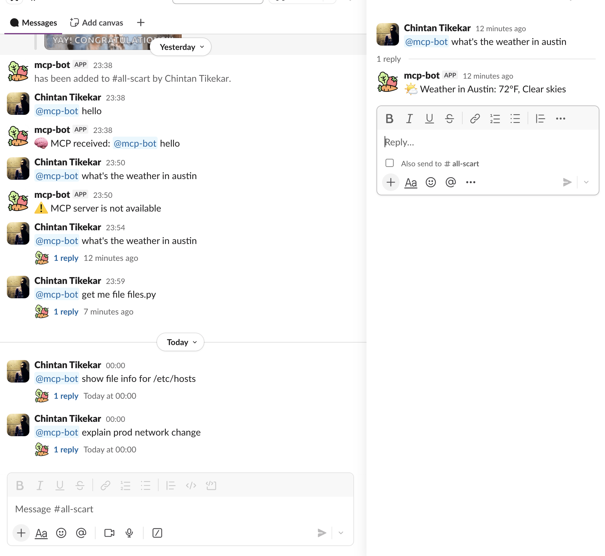

####

### Step1 Create slack app

Configure app

Once App is created,

Go to : https://api.slack.com/apps

Create New App

From scratch

Name: mcp-bot

Workspace: your workspace

Enable Bot permissions

OAuth & Permissions → Bot Token Scopes
Add:

```
app_mentions:read
chat:write
channels:history
```

Click Install to Workspace

Copy: Bot User OAuth Token (xoxb-...)

Enable Events

Event Subscriptions
```
Enable Events: ✅

Request URL (we’ll add later)

Subscribe to bot events:

app_mention

```

### .env file
```
SLACK_BOT_TOKEN=xoxb-####
SLACK_SIGNING_SECRET=####
```

### commands needs to run
```
uv venv
uv pip install slack-bolt fastapi uvicorn httpx python-dotenv

uv run uvicorn mcp_server:app --port 3333
uv run uvicorn slack_bot:api --port 3000

ngrok http 3000
```

put `ngrok http 3000` url into slack.

You’ll get something like:

```
https://abc123.ngrok.io
```
Set Slack Request URL to:
```
https://abc123.ngrok.io/slack/events
```

### Test code
```
@mcp-bot what's the weather in austin
@mcp-bot show file info for /etc/hosts
@mcp-bot explain prod network change
@mcp-bot check vcn update
```



### Next steps: LLM-based tool selection
#####
```

This is what actually want long-term.

Router prompt (conceptual)

Given a user message, select the best tool and arguments.

Tools:
- get_weather(city)
- get_file_info(path)
- explain_network_change(change_id)

User message: "{text}"

Return JSON:
{ "tool": "...", "args": {...} }


Plug:

OpenAI

local LLM

OCI GenAI

Claude
later — tools stay unchanged.

```


#####
```
Next natural upgrades:

1️⃣ Replace router.py with an LLM-based router
2️⃣ Auto-generate tool schema (name, args, docstring)
3️⃣ Permissions per Slack user
4️⃣ Observability (tool call tracing)
5️⃣ Feedback loop (improves routing)
```